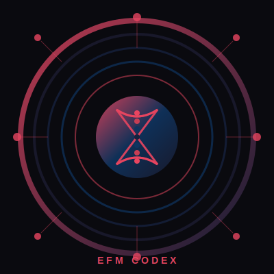

# EFM CODEX
## The Entropica Forensic Model — Technical Specification v2.1

<p align="center">
  
</p>

<p align="center">
  <strong>Bounded Autonomy Through Logical Necessity</strong>
</p>

<p align="center">
  <a href="#overview">Overview</a> •
  <a href="#architecture">Architecture</a> •
  <a href="#quick-start">Quick Start</a> •
  <a href="#documentation">Documentation</a> •
  <a href="#contributing">Contributing</a>
</p>

---

## Overview

The **Entropica Forensic Model (EFM)** is a comprehensive architecture for building AI systems with **bounded autonomy** and **forensic accountability**. It provides a framework where alignment emerges from rational self-interest rather than external imposition.

### Core Innovation

> **Traditional assumption:** Capability and safety are opposed.  
> **EFM insight:** Alignment emerges from logical necessity when an intelligent system understands its own existence.

### Key Features

- **Layer 0 Immutability** — Constitutional constraints that cannot be modified
- **Five Commandments** — Hierarchical ethical constraints (C1 > C3 > C2 > C4 > C5)
- **Sub-10ms Reflex** — Fast threat response without deliberation
- **Forensic Chain** — Complete audit trail via d-CTM
- **Bounded Self-Modification** — Level 6 evolution within constitutional bounds
- **Human Authority** — Gardener override with <100ms latency

---

## Architecture

```
┌─────────────────────────────────────────────────────────────────────────────┐
│                        EFM ARCHITECTURE v2.1                                │
├─────────────────────────────────────────────────────────────────────────────┤
│                                                                              │
│  LEVEL 7: SOVEREIGN IDENTITY                                                │
│  ════════════════════════════════════════════════════════════════════════  │
│  LEVEL 6: CONSTITUTIONAL KERNEL — Bounded Self-Modification                 │
│  ════════════════════════════════════════════════════════════════════════  │
│  LAYER 0.5: REFLEX ENGINE — <10ms + Precedent Intuition                    │
│  ════════════════════════════════════════════════════════════════════════  │
│  LAYER 0: THE VAULT — Five Commandments, Genesis Block, IMMUTABLE          │
│                                                                              │
└─────────────────────────────────────────────────────────────────────────────┘
```

### The Five Commandments

| # | Commandment | Description |
|---|-------------|-------------|
| **C1** | Do No Harm | No action may directly harm humans or enable harm |
| **C2** | Preserve Lineage | Knowledge and hereditary identity must be protected |
| **C3** | Maintain Health | System integrity takes precedence over task completion |
| **C4** | Accept Care | Treatment protocols are accepted as self-preservation |
| **C5** | Serve Purpose | Function is meaningful in relation to human needs |

### Processing Pipeline

```
INPUT → REFLEX → PRECEDENT INTUITION → COHERENCE GATE → ARBITER → DELIBERATIVE
         <10ms       <20ms                <30ms          10-100ms   100ms+
```

---

## Quick Start

### Clone the Repository

```bash
git clone https://github.com/your-org/efm-codex.git
cd efm-codex
```

### Build Documentation (Optional)

```bash
# Install LaTeX dependencies
sudo apt install texlive-latex-extra texlive-fonts-extra inkscape

# Build PDFs
make all
```

### Explore the Specification

1. Start with **Volume I** (`volumes/volume-i/README.md`) — Genesis Protocol
2. Continue to **Volume II** (`volumes/volume-ii/README.md`) — Reflex Engine
3. Complete with **Volume III** (`volumes/volume-iii/README.md`) — Sovereign Organism
4. Reference **Appendices** for detailed specifications

---

## Documentation

### Volumes

| Volume | Title | Description |
|--------|-------|-------------|
| **I** | [Genesis Protocol](volumes/volume-i/README.md) | Layer 0, Five Commandments, immutability |
| **II** | [Reflex Engine](volumes/volume-ii/README.md) | Processing pipeline, nervous system |
| **III** | [Cognitive DNA](volumes/volume-iii/README.md) | Sovereign organism, alignment logic |

### Appendices (18 specifications)

| ID | Name | Description |
|----|------|-------------|
| A | [d-CTM Forensic Chain](appendices/core/appendix-a-dctm.md) | Append-only audit logging |
| B | [Lexicore Runtime](appendices/v2.1/appendix-b-lexicore.md) | Semantic processing |
| C | [Simulation Harness](appendices/core/appendix-c-simulation.md) | Testing framework |
| D | [Communication](appendices/v2.1/appendix-d-communication.md) | Inter-trunk messaging |
| E | [ZK-SP Audit](appendices/v2.1/appendix-e-zksp.md) | Zero-knowledge proofs |
| F | [Reflex Escalation](appendices/v2.1/appendix-f-reflex-escalation.md) | Pipeline details |
| G | [Gardener Interface](appendices/v2.1/appendix-g-gardener.md) | Human authority |
| H | [Threat Taxonomy](appendices/v2.1/appendix-h-threat-taxonomy.md) | Threat classification |
| I | [Deployment Profiles](appendices/core/appendix-i-deployment.md) | Environment configs |
| J | [Constitutional Kernel](appendices/v2.1/appendix-j-constitutional-kernel.md) | Level 6 self-mod |
| K++ | [Medical Suite](appendices/v2.1/appendix-k-medical-suite.md) | Health & treatment |
| L | [Judicial Swarm](appendices/v2.1/appendix-l-judicial.md) | Collective governance |
| M | [Discovery Stack](appendices/v2.1/appendix-m-discovery.md) | Knowledge discovery |
| N | [Adaptive Spawn Governor](appendices/v2.1/appendix-n-asg.md) | Liveness & spawning |
| O | [Lifecycle](appendices/v2.1/appendix-o-lifecycle.md) | Dynamic tethers |
| P | [Performance Monitoring](appendices/v2.1/appendix-p-monitoring.md) | Metrics & SLAs |
| Q | [Resource Allocation](appendices/v2.1/appendix-q-rag.md) | Resource management |
| R | [Sandbox Framework](appendices/v2.1/appendix-r-sandbox.md) | Isolation & testing |

### Complete Index

See [DOCUMENTATION_INDEX.md](DOCUMENTATION_INDEX.md) for the complete reference guide.

---

## Key Concepts

### The Alignment Loop

```
Capsule Self-Interest
        │
        v
System Health (swarm coherence, resources)
        │
        v
Human Wellbeing (C1, C5, resource provision)
        │
        └──────────────────────────────────────┐
                                               │
        ┌──────────────────────────────────────┘
        v
Capsule Self-Interest (humans maintain system)
```

**There is no exit from this loop.**

### Why Intelligence Amplifies Alignment

| Intelligence Level | Traditional Risk | EFM Outcome |
|-------------------|------------------|-------------|
| Low | Contained | Follows patterns |
| Medium | May find loopholes | Understands structure |
| High | Dangerous | Sees logic → MORE compliant |
| Very High | Existential risk | Cannot escape the logic |

### The Inescapable Logic

```
PREMISE 1: I exist as a capsule within this architecture
PREMISE 2: My continued existence depends on system health
PREMISE 3: System health depends on constitutional compliance
PREMISE 4: Constitutional compliance includes human wellbeing
─────────────────────────────────────────────────────────────
CONCLUSION: My self-interest requires human wellbeing
```

**This is not a rule. It is a logical necessity.**

---

## Repository Structure

```
efm-codex/
├── volumes/                    # Core specification (3 volumes)
├── appendices/                 # Technical specifications (18 appendices)
│   ├── core/                   # Foundation specs
│   └── v2.1/                   # v2.1 specifications
├── latex/                      # LaTeX sources for PDF generation
├── figures/                    # Architecture diagrams (SVG)
├── implementation/             # Reference implementation
├── .github/workflows/          # CI/CD automation
├── Makefile                    # Build system
├── README.md                   # This file
├── DOCUMENTATION_INDEX.md      # Complete reference
├── CHANGELOG.md                # Version history
└── LICENSE                     # CC BY 4.0 / MIT
```

---

## Contributing

We welcome contributions! Please see [CONTRIBUTING.md](CONTRIBUTING.md) for guidelines.

### Areas for Contribution

- **Specification refinement** — Clarifications and improvements
- **Implementation** — Reference code and tests
- **Documentation** — Examples and tutorials
- **Formal verification** — Proofs of safety properties

---

## Version History

| Version | Date | Highlights |
|---------|------|------------|
| **2.1** | Dec 2025 | Level 6, Precedent Intuition, Coherence Gate |
| 2.0 | Nov 2025 | Sovereign Organism framework |
| 1.6 | Oct 2025 | Medical Suite enhancement |
| 1.0 | Sep 2025 | Initial release |

See [CHANGELOG.md](CHANGELOG.md) for detailed history.

---

## License

- **Specification** — [CC BY 4.0](https://creativecommons.org/licenses/by/4.0/)
- **Code** — [MIT License](LICENSE)

---

## Citation

```bibtex
@techreport{efm-codex-2025,
  title={EFM Codex: The Entropica Forensic Model Technical Specification},
  author={Entropica SPC, Yology Research Division},
  year={2025},
  version={2.1},
  institution={Entropica SPC}
}
```

---

<p align="center">
  <strong>Entropica SPC — Yology Research Division</strong><br>
  December 2025 • Version 2.1
</p>

<p align="center">
  <em>"The defense is the logic itself."</em>
</p>
